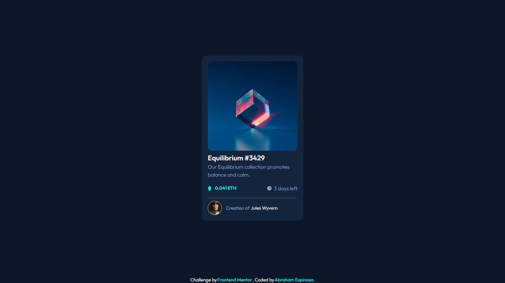

# Frontend Mentor - NFT preview card component solution

This is a solution to the [NFT preview card component challenge on Frontend Mentor](https://www.frontendmentor.io/challenges/nft-preview-card-component-SbdUL_w0U). Frontend Mentor challenges help you improve your coding skills by building realistic projects. 

## Table of contents
  - [The challenge](#the-challenge)
  - [Screenshot](#screenshot)
  - [Links](#links)
  - [Built with](#built-with)
  - [Author](#author)

### The challenge

Users should be able to:

- View the optimal layout depending on their device's screen size
- See hover states for interactive elements

### Screenshot

### Links

- Solution URL: [Add solution URL here](https://github.com/AbrahamEspina/nft-preview-card-component)
- Live Site URL: [Add live site URL here](https://nft-card-345.netlify.app/)

### Built with

- Semantic HTML5 markup
- Chakra-ui/react
- Mobile-first workflow
- [React](https://reactjs.org/) - JS library

## Author

- Website - [Abraham Espinosa](https://abraham-portfolio-2022.netlify.app/)
- Frontend Mentor - [@AbrahamEspina](https://www.frontendmentor.io/profile/@AbrahamEspina)
